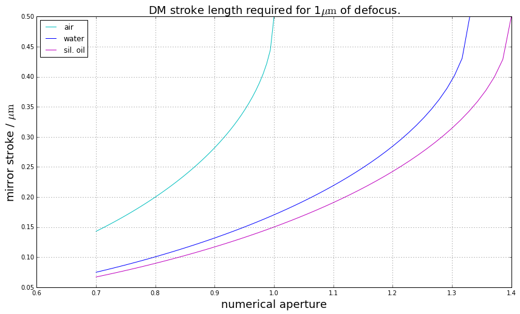

# Reference material

## SHCS counterbores

Counterbore dimensions for ISO 4762 socket head cap screws.

  | size  | Ø cbore | ↧ cbore |  Ø clear  |
  | :---  |    ---: |    ---: |      ---: |
  | M3    | 6.5     | 3.4     |  3.4      |
  | M4    | 8.0     | 4.6     |  4.5      |
  | M5    | 10.0    | 5.7     |  5.5      |
  | M6    | 11.0    | 6.8     |  6.6      |

## Enclosure manufacturers

* [Herzan](http://www.herzan.com/products/custom-solutions/custom-acoustic-enclosures.html) - UK distributor, CN Tech (Clive)
* [TMC](http://www.techmfg.com/products/acoustic-enclosure-and-precision-structure/muliti-purposeacousticenclosures)
* [TCS Ltd](https://tcsltd.org.uk/products/) No info on website. Contact Bob Smith.

## Deformable mirrors

### Low actuator count

As at 2017-07-25

  | manufacturer    |  model         | type         | pupil diameter / mm  | actuator count  | stroke / µm  | settling time / ms       |
  | :---            | :---           | :---         |                 ---: |            ---: |         ---: |                     ---: |
  |ALPAO            |  DM 69         | continuous   | 10.5                 | 69              | 60           | 0.8                      |
  |ALPAO            |  DM 88         | continuous   | 20.0                 | 88              | 40           | 1.6                      |
  |ALPAO            |  DM 97-08      | continuous   | 7.2                  | 97              | 80           | 1.6                      |
  |ALPAO            |  DM 97-15      | continuous   | 13.5                 | 97              | 60           | 0.8                      |
  |BMC              |  Mini-1.5      | continuous   | 1.5                  | 32              | 1.5          | 0.02                     |
  |BMC              |  Mini-3.5      | continuous   | 2.0                  | 32              | 3.5          | 0.1                      |
  |BMC              |  Mini-5.5      | continuous   | 2.25                 | 32              | 5.5          | 0.5                      |
  |BMC              |  Multi-1.5     | continuous   | 3.3                  | 140             | 1.5          | 0.06                     |
  |BMC              |  Multi-3.5     | continuous   | 4.4                  | 140             | 3.5          | 0.1                      |
  |BMC              |  Multi-5.5     | continuous   | 4.95                 | 140             | 5.5          | 0.5                      |
  |Iris AO          |  PTT111        | segmented    | 3.5                  | 111             | 5 or 8       | 0.2                      |
  |Iris AO          |  PTT111L       | segmented    | 7.0                  | 111             | 5 or 8       | 0.2                      |
  |Imagine Optic    |  MIRAO 52E     | continuous?  | 15                   | 52              | 50           | ?                        |
  |Northrop Grumman |  PH02.5S3-37   | continuous   | 17                   | 49              | 2.5          | ?                        |
  |OKO              |  MMDM15-37     | continuous   | 15                   | 37              | 10           | ?                        |
  |OKO              |  MMDM15-17-TT  | continuous   | 15                   | 17 + tip/tilt   | 10           | ?                        |
  |OKO              |  MDM96-25.4    | continuous   | 25.4                 | 96              | 19           | 0.5 (2kHz refresh rate)  |

### Other manufacturers

  | Manufacturer | Notes
  | --- | ---
  | [Adaptica](http://www.adaptica.com/products/adaptive-optics/modular-adaptive-optics/) | Two devices: 2 inch, 32+16 actuators, and 30mm, 32 actuators.
  | [Northrop-Grumman](http://www.northropgrumman.com/BusinessVentures/AOAXinetics/IntelligentOptics/Products/Pages/DeformableMirrors.aspx) | Larger aperture devices up to 241.3mm.

### Stroke length and defocus

